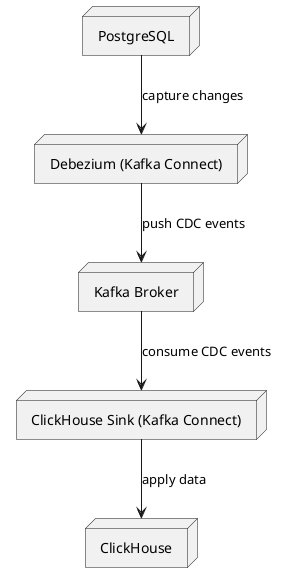

# Kafka PostgreSQL to ClickHouse CDC Sync

## Summary
This project sets up a Change Data Capture (CDC) pipeline using Debezium to synchronize data changes from PostgreSQL to ClickHouse via Kafka. It handles automatic schema evolution, real-time data replication, and ensures data consistency between PostgreSQL and ClickHouse.

## Diagram Visualization
- [CDC Sync Pipeline Visualization](//www.plantuml.com/plantuml/png/ROunJiGm44NxESLeAoZs0YdGYco110LeJp0amoQoFROyDXAS7iVsHa9G_ddFt_-aYMBApWA8dnaFhrxJDVBbxUM0f1XQr4xF_CxVQtPuzqmVXd3q8Zob--hE7NQt6O_H6uwLc-tGuMZNoJpvh8oNLSo_VTEY1VrvqDWMboq2t3RYyVYmZnXmef1ov593ScK5kA7grJ43XgmBZkSH-PCb5QdUgz6-BprUD3l-PJNMj7t9W1I2_SAP4W6SMERix0y0)


## Diagram PUML Script


## Project Files Structure
```
kafka-postgres-to-clickhouse
├── docker-compose.yml
├── Dockerfile.postgres-connect
├── setup.sh
├── plugins
│   └── debezium-postgres-connector
└── scripts
    └── ddl_sync.sql
```

## Setup Details Documentation
1. **Build Docker Containers**:
   ```sh
   ./setup.sh
   ```

2. **Initialize Services**:
   - Zookeeper
   - Kafka Broker
   - PostgreSQL
   - Debezium PostgreSQL Source Connector
   - ClickHouse
   - ClickHouse Kafka Sink Connector

3. **Database Schema Setup**:
   - Creates PostgreSQL database `iman`
   - Generates and applies ClickHouse schema automatically based on PostgreSQL

4. **Data Synchronization Flow**:
   - Debezium captures PostgreSQL CDC events
   - Kafka Connect Sink consumes and writes data into ClickHouse

5. **Validation**:
   - Inserts test rows into PostgreSQL
   - Confirms Kafka topic message ingestion
   - Verifies successful data replication to ClickHouse

## Successful Setup Logs

```logs
🟢 Starting Docker Compose services...
[+] Building 0.3s (8/8) FINISHED                                                                           
 => [internal] load local bake definitions                                                            0.0s
 => => reading from stdin 475B                                                                        0.0s
 => [internal] load build definition from Dockerfile.postgres-connect                                 0.0s
 => => transferring dockerfile: 589B                                                                  0.0s
 => [internal] load metadata for debezium/connect:2.5                                                 0.0s
 => [internal] load .dockerignore                                                                     0.0s
 => => transferring context: 2B                                                                       0.0s
 => [1/2] FROM debezium/connect:2.5                                                                   0.0s
 => CACHED [2/2] RUN mkdir -p /kafka/connect/plugins/postgres &&     curl -L -o /kafka/connect/plugi  0.0s
 => exporting to image                                                                                0.0s
 => => exporting layers                                                                               0.0s
 => => writing image sha256:12831cce598cd2b2d8cd408f1aab30c866e4528533ccd081e0c3b04365871013          0.0s
 => => naming to docker.io/library/kafka-postgres-to-clickhouse-postgres-connect                      0.0s
 => resolving provenance for metadata file                                                            0.0s
[+] Running 9/9
 ✔ postgres-connect                                       Built                                       0.0s 
 ✔ Network kafka-postgres-to-clickhouse_kafka-network     Created                                     0.1s 
 ✔ Volume "kafka-postgres-to-clickhouse_clickhouse_data"  Created                                     0.0s 
 ✔ Container zookeeper                                    Healthy                                    11.1s 
 ✔ Container postgres                                     Healthy                                    11.8s 
 ✔ Container broker                                       Healthy                                    21.7s 
 ✔ Container postgres-connect                             Started                                    21.9s 
 ✔ Container clickhouse                                   Started                                    11.4s 
 ✔ Container clickhouse-connect                           Started                                    11.4s 
/var/run/postgresql:5432 - accepting connections
ruok is not executed because it is not in the whitelist.

🗃 Creating ClickHouse database and schema 'iman'...

📦 Extracting PostgreSQL schema and generating ClickHouse DDL...

🛠 Applying generated DDL to ClickHouse...
CREATE TABLE IF NOT EXISTS iman.users (user_id UInt32, username String, account_type String, updated_at DateTime64(6), created_at DateTime64(6)) ENGINE = ReplacingMergeTree() ORDER BY user_id;

🧩 Registering Debezium PostgreSQL source connector...
{"name":"postgres-source-connector","config":{"name":"postgres-source-connector","connector.class":"io.debezium.connector.postgresql.PostgresConnector","database.hostname":"postgres","database.port":"5432","database.user":"postgres","database.password":"postgres","database.dbname":"iman","schema.include.list":"iman","database.server.name":"postgres_cdc","topic.prefix":"postgres_cdc","plugin.name":"pgoutput","slot.name":"debezium_slot","publication.autocreate.mode":"filtered","snapshot.mode":"initial","slot.drop.on.stop":"true","tombstones.on.delete":"false","key.converter":"org.apache.kafka.connect.json.JsonConverter","value.converter":"org.apache.kafka.connect.json.JsonConverter","key.converter.schemas.enable":"true","value.converter.schemas.enable":"true","producer.override.acks":"all","producer.override.retries":"10","producer.override.delivery.timeout.ms":"60000","transforms":"unwrap","transforms.unwrap.type":"io.debezium.transforms.ExtractNewRecordState","transforms.unwrap.drop.tombstones":"true"},"tasks":[],"type":"source"}
🧩 Registering ClickHouse Sink connector...
{"name":"clickhouse-sink-connector","config":{"name":"clickhouse-sink-connector","connector.class":"com.clickhouse.kafka.connect.ClickHouseSinkConnector","topics":"postgres_cdc.iman.users","transforms":"route","transforms.route.type":"org.apache.kafka.connect.transforms.RegexRouter","transforms.route.regex":"^postgres_cdc\\.iman\\.(.*)$","transforms.route.replacement":"$1","table.name.format":"${topic}","hostname":"clickhouse","port":"8123","database":"iman","user":"default","password":"password","auto.create.tables":"true","auto.evolve.tables":"true","table.engine":"ReplacingMergeTree","table.primaryKey":"user_id","key.converter":"org.apache.kafka.connect.json.JsonConverter","value.converter":"org.apache.kafka.connect.json.JsonConverter","key.converter.schemas.enable":"true","value.converter.schemas.enable":"true","consumer.override.auto.offset.reset":"earliest","errors.tolerance":"all","errors.log.enable":"true","errors.log.include.messages":"true","tasks.max":"1"},"tasks":[],"type":"sink"}
📝 Inserting test rows into PostgreSQL...
INSERT 0 3

📊 Rows in PostgreSQL:
 user_id | username | account_type |         updated_at         |         created_at         
---------+----------+--------------+----------------------------+----------------------------
       1 | user1    | Bronze       | 2025-08-02 17:30:42.030174 | 2025-08-02 17:30:42.030174
       2 | user2    | Silver       | 2025-08-02 17:30:42.030174 | 2025-08-02 17:30:42.030174
       3 | user3    | Gold         | 2025-08-02 17:30:42.030174 | 2025-08-02 17:30:42.030174
(3 rows)


📬 Messages in Kafka topic:
{"schema":{"type":"struct","fields":[{"type":"int32","optional":false,"default":0,"field":"user_id"},{"type":"string","optional":true,"field":"username"},{"type":"string","optional":true,"field":"account_type"},{"type":"int64","optional":true,"name":"io.debezium.time.MicroTimestamp","version":1,"field":"updated_at"},{"type":"int64","optional":true,"name":"io.debezium.time.MicroTimestamp","version":1,"field":"created_at"}],"optional":false,"name":"postgres_cdc.iman.users.Value"},"payload":{"user_id":1,"username":"user1","account_type":"Bronze","updated_at":1754155842030174,"created_at":1754155842030174}}
{"schema":{"type":"struct","fields":[{"type":"int32","optional":false,"default":0,"field":"user_id"},{"type":"string","optional":true,"field":"username"},{"type":"string","optional":true,"field":"account_type"},{"type":"int64","optional":true,"name":"io.debezium.time.MicroTimestamp","version":1,"field":"updated_at"},{"type":"int64","optional":true,"name":"io.debezium.time.MicroTimestamp","version":1,"field":"created_at"}],"optional":false,"name":"postgres_cdc.iman.users.Value"},"payload":{"user_id":2,"username":"user2","account_type":"Silver","updated_at":1754155842030174,"created_at":1754155842030174}}
{"schema":{"type":"struct","fields":[{"type":"int32","optional":false,"default":0,"field":"user_id"},{"type":"string","optional":true,"field":"username"},{"type":"string","optional":true,"field":"account_type"},{"type":"int64","optional":true,"name":"io.debezium.time.MicroTimestamp","version":1,"field":"updated_at"},{"type":"int64","optional":true,"name":"io.debezium.time.MicroTimestamp","version":1,"field":"created_at"}],"optional":false,"name":"postgres_cdc.iman.users.Value"},"payload":{"user_id":3,"username":"user3","account_type":"Gold","updated_at":1754155842030174,"created_at":1754155842030174}}
[2025-08-02 17:30:58,239] ERROR Error processing message, terminating consumer process:  (kafka.tools.ConsoleConsumer$)
org.apache.kafka.common.errors.TimeoutException
Processed a total of 3 messages

🏁 Rows in ClickHouse:
Row 1:
──────
user_id:      2
username:     user2
account_type: Silver
updated_at:   2025-08-02 17:30:42.030174
created_at:   2025-08-02 17:30:42.030174

Row 2:
──────
user_id:      3
username:     user3
account_type: Gold
updated_at:   2025-08-02 17:30:42.030174
created_at:   2025-08-02 17:30:42.030174

Row 3:
──────
user_id:      1
username:     user1
account_type: Bronze
updated_at:   2025-08-02 17:30:42.030174
created_at:   2025-08-02 17:30:42.030174

✅ Integration test passed. Data synced correctly.
```

